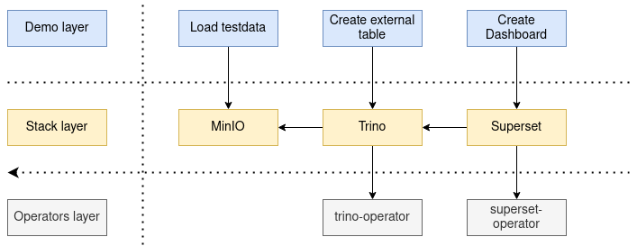

# stackablectl

**IMPORTANT: This document is outdated!**

The interface of stackablectl is not decided yet.
When the interface is stable we will write docs on how to use stackablectl and put them on our docs website.
Until than this document is mean for internal usage and will be replaced by the new docs.

## Building
You need to have Rust and go installed.
To run stackablectl you need to execute the following commands:
``` bash
sbernauer@sbernauer:~/stackabletech/stackablectl$ cd go-helm-wrapper/ && ./build.sh && cd ..
# [...]

sbernauer@sbernauer:~/stackabletech/stackablectl$ cargo r
    Finished dev [unoptimized + debuginfo] target(s) in 0.03s
     Running `target/debug/stackablectl`
stackablectl 0.1.0
Stackable GmbH <info@stackable.de>
Command line tool to interact with a Stackable Data Platform
# [...]
```

We separate the deployed services into 3 layers:

| Layer         | Description                                                 | Examples                                      |
|---------------|-------------------------------------------------------------|-----------------------------------------------|
| **Operators** | The operators needed to operate the Stackable Data Platform | `trino-operator`, `superset-operator`         |
| **Stack**     | The data products                                           | `Trino`, `Apache Superset`                    |
| **Demo**      | The demos that prepare data and run the applications        | Demo loading and analyzing New York taxi data |



Each layer gets deployed via its dedicated `stackablectl` command

## Deploying
### Operators
Operators manage the products of the Stackable Data Platform.
This command can be used as a direct replacement of `create_test_cluster.py`.
We decided to drop dependency resolution (like the superset operator requires the commons-, secret-, druid-, trino-operator and a postgres) for the following reasons:
1. Imagine the situation "install `trino=1.2.3` and `superset`". Superset expresses a dependency on the latest Trino version.
Now the situation gets complicated because we have conflicting version requirements for the trino-operator.
We could try to resolve this using dependency trees and other magic stuff.
2. Even more important: When you deploy the superset-operator `stackablectl` has no way to know to which data products you want integrate with.
Because of this it would need to deploy the operators for **all** the products Superset supports.
As a result it would install like 90% of the operators by simply specifying Superset.
And all of that on possible non-fixed versions.

We also don't deploy examples any more as that functionality is now provided by the stack layer below.

As an alternative we provide the possibly to provide a simple yaml file containing the list of operators needed for a particular demo, stack or integration test (more on that below).
The yaml file simply contains a list of operators to install including an optional version.
We used the same notation (`name[=version]`) as when using the CLI for easy copy/pasting.

#### Command with arguments (meant for developers)
```bash
stackablectl operator install commons secret trino superset=0.3.0
```

#### Command with file (meant for end-users)
A operator layer's definition looks like the following:

`demo-nytaxidata/operators.yaml`
```yaml
operators:
  - commons
  - secret
  - trino
  - superset=0.3.0
```
Call it by the directory
```bash
stackablectl deploy-operators demo-nytaxidata/
```
Or directly from GitHub
```bash
stackablectl deploy-operators https://raw.githubusercontent.com/stackabletech/demos/main/demo-nytaxidata/
```

### Stack
A Stack contains data products that are managed by Stackable operators. Additional products like MinIO, Prometheus and Grafana can also be included.

If you deploy a Stack with `stackablectl` it will automatically install the needed operators layer.
For this to work you also need to include the `operators.yaml` in your stack.

#### Command
`demo-nytaxidata/operators.yaml`
```yaml
operators:
  - commons
  - secret
  - trino
  - superset=0.3.0
```

`demo-nytaxidata/stack.yaml`
```yaml
kind: ZookeeperCluster
  [...]
---
kind: KafkaCluster
  [...]
---
kind: DruidCluster
  [...]
---
kind: SupersetCluster
  [...]
```

`demo-nytaxidata/additional-services.yaml`
```yaml
services:
  - postgres:
      name: postgres-superset
      version: 11.0.0
      username: superset
      password: superset
      database: superset
  - postgres:
      name: postgres-druid
      version: 11.0.0
      username: druid
      password: druid
      database: druid
  - minio:
      name: minio
      version: 4.2.3
      accessKey: minio
      secretKey: minio
      servers: 1
      size: 10Mi
  - prometheus:
      name: prometheus
```

Call it by the directory
```bash
stackablectl deploy-stack demo-nytaxidata/
```
Or directly from GitHub
```bash
stackablectl deploy-stack https://raw.githubusercontent.com/stackabletech/demos/main/demo-nytaxidata/
```

The command will
1. Install the operators the same way the `stackablectl deploy-operators ...` command would do
2. Install the additional services listed in `additional-services.yaml`. It uses something like
`helm repo add bitnami https://charts.bitnami.com/bitnami` and
`helm install postgres-superset bitnami/postgresql --version 11.0.0 --set auth.username=superset --set auth.password=superset --set auth.database=superset`
4. Wait for the additional services to be ready
5. Apply the manifests inside `stack.yaml`
6. Wait for the stack to be ready

### Demo
The highest layer - demo - is not really needed to spin up a Stackable Data Platform.
It enables us to run end-to-end demos with a single command.

If you deploy a Demo with `stackablectl` it will automatically install the needed stack and operators layers. 

TODO: Design files needed to deploy the demo.
Rob currently modelled them as helm-charts.
Of course the files defining the stack must be included as well.

Call it by the directory
```bash
stackablectl deploy-demo demo-nytaxidata/
```
Or directly from GitHub
```bash
stackablectl deploy-demo https://raw.githubusercontent.com/stackabletech/demos/main/demo-nytaxidata/
```
